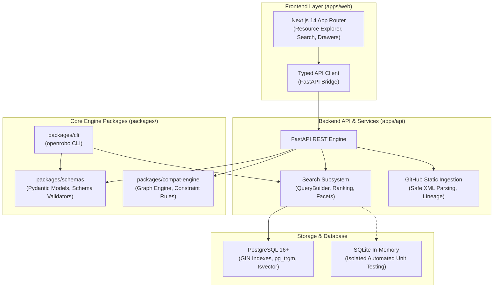

<div align="center">

# OpenRobo

**Open-source robotics platform for discovering components, reasoning about compatibility, building robot stacks, and generating reproducible developer environments.**

[](https://opensource.org/licenses/Apache-2.0)
[](https://www.python.org/)
[](https://www.typescriptlang.org/)
[](https://fastapi.tiangolo.com/)
[](https://nextjs.org/)
[](https://docs.ros.org/)
[](#architecture)

</div>

---

## What is OpenRobo?

Robotics software engineering is fragmented across hundreds of isolated repositories, disparate ROS packages, custom sensor drivers, and fragile dependency chains. Integrating a robot stack—from LiDAR SLAM and arm kinematics to hardware interfaces and simulation—often requires hours of manual dependency debugging.

**OpenRobo** provides a standardized, vendor-neutral software registry and intelligent reasoning platform for modern robotics:
- **Discover Components**: Search thousands of ROS 2 packages, hardware drivers, simulation models, and algorithms with weighted full-text and fuzzy typo-tolerant indexing.
- **Understand Compatibility**: Graph-based constraint validation mapping cross-package compatibility across ROS distributions, CPU architectures, and OS kernels.
- **Build Robot Stacks**: Compose modular robotics architectures with interactive dependency checking (*upcoming in M4*).
- **Generate Workspaces**: Export reproducible Dockerfiles, Dev Containers, and Colcon overlay workspaces (*upcoming in M5*).

---

## Implemented Features (Available Now)

- [x] **Canonical Robotics Schemas**: JSON Schema (Draft 2020-12) standards for resource manifests (`resource.schema.json`), compatibility graphs (`graph.schema.json`), and robot stacks (`stack.schema.json`).
- [x] **Zero-Extra-Infrastructure Search Engine**: PostgreSQL-backed weighted full-text search (`tsvector`, GIN indexes) with `pg_trgm` fuzzy similarity matching and multi-taxonomy faceting.
- [x] **Resource Explorer Web App**: Dark-mode, high-density Next.js 14 web interface featuring dynamic facet counts, search highlight rendering, platform matrix badges, and shareable URL query state (`/resources?q=nav2&domain=navigation`).
- [x] **Static Robotics Repository Ingestion**: Safe, non-executing static analysis of GitHub repositories extracting ROS `package.xml` manifests, dependencies, maintainers, and licenses with full provenance tracking.
- [x] **Unified CLI**: Typer/Rich command-line suite for schema validation, static GitHub ingestion, and ranked registry search.
- [x] **Cross-Platform Compatibility**: Full first-class support for Linux, macOS, and Windows development workflows.

---

## Architecture

OpenRobo is structured as a zero-extra-infrastructure monorepo managed with **pnpm** and **Python virtual environments**:



### Monorepo Structure

```
OpenRobo/
├── apps/
│   ├── api/                   # FastAPI backend, PostgreSQL models, search & ingestion
│   └── web/                   # Next.js 14 Resource Explorer frontend
├── packages/
│   ├── schemas/               # Python schema bindings and validator package
│   ├── compat-engine/         # Graph-based compatibility and constraint reasoning
│   └── cli/                   # Typer & Rich interactive CLI (openrobo)
├── schemas/                   # Canonical JSON Schemas (Draft 2020-12)
├── samples/                   # Sample manifests & seed robotics datasets
├── scripts/                   # Automated schema validation and database seeding
└── docs/                      # Architectural Decision Records (ADRs) and Milestone specs
```

---

## Quick Start

### Prerequisites
- **Node.js**: `v18+` or `v20+`
- **pnpm**: `v8+` or `v9+`
- **Python**: `3.10`, `3.11`, or `3.12`

### 1. Install Dependencies

```bash
# Clone the repository
git clone https://github.com/Tanishk756/OpenRobo.git
cd OpenRobo

# Install Node workspace dependencies
pnpm install

# Install Python workspace packages in editable mode
python -m pip install -e packages/schemas -e packages/compat-engine -e packages/cli -e "apps/api[test]"
```

### 2. Verify System & Run Tests

```bash
# Runs full gate: Linter + JSON Schema Validator + Pytest (33 tests) + Vitest (6 tests) + Next.js Build
pnpm run check
```

### 3. Start Local Services

```bash
# Start FastAPI backend (http://localhost:8000)
pnpm run dev:api

# Start Next.js Resource Explorer (http://localhost:3000)
pnpm run dev:web

# Seed 20+ canonical robotics resources into the local database
pnpm run seed
```

---

## CLI Usage

The `openrobo` CLI provides instant developer commands for searching, validating, and ingesting robotics components:

```bash
# Search robotics registry with ranking & typo tolerance
openrobo search "nav2"
openrobo search "slam" --domain mapping --limit 10

# Validate a resource manifest against the canonical schema
openrobo validate samples/ros2_control.resource.json

# Statically ingest a robotics repository from GitHub (safe, no code execution)
openrobo ingest github https://github.com/ros-navigation/navigation2
```

---

## Search Engine & Taxonomy Indexing

OpenRobo Milestone 2 introduces a PostgreSQL-native search architecture:

| Feature | Implementation | Description |
| :--- | :--- | :--- |
| **Weighted FTS** | `tsvector` + GIN Indexes | Name (`Weight A`), Summary (`Weight B`), Description (`Weight C`) |
| **Fuzzy Matching** | `pg_trgm` Trigram Similarity | Typo tolerance (e.g. `plotjugler` discovers `PlotJuggler`) |
| **Multi-Taxonomy Facets** | Category Aggregations | Dynamic counts across resource types, domains, capabilities, licenses, and ROS distros |
| **Search Highlights** | Regex Token Highlighting | Matching tokens highlighted directly in card descriptions |
| **Shareable URL State** | Next.js Query Params | Browser URLs persist search filters (e.g. `/resources?q=slam&domain=mapping`) |

---

## Roadmap

| Milestone | Focus Area | Status |
| :--- | :--- | :--- |
| **M0 — Foundation** | Canonical JSON Schemas, CI/CD, Monorepo Setup | :white_check_mark: Completed |
| **M1 — Registry & Discovery** | Resource Registry Engine, Static Ingestion, Resource Explorer UI | :white_check_mark: Completed |
| **M2 — Search & Taxonomy** | PostgreSQL FTS, Trigram Fuzzy Search, Facets, CLI Search | :white_check_mark: Completed |
| **M3 — Compatibility Intelligence** | Graph-Based Constraint Reasoning, ROS Compatibility Matrix | :construction: Planned |
| **M4 — Interactive Stack Builder** | Stack Composition, Dependency Conflict Resolution UI | :crystal_ball: Planned |
| **M5 — Workspace Generator** | Dev Container, Dockerfile, and Colcon Workspace Generation | :crystal_ball: Planned |

---

## Community & Contributing

We welcome contributions from robotics engineers, software developers, and researchers!
- Check out our [Contributing Guide](CONTRIBUTING.md) to get started.
- Read our [Code of Conduct](CODE_OF_CONDUCT.md) to understand community standards.
- Review our [Security Policy](SECURITY.md) for vulnerability reporting.

---

## License

OpenRobo is licensed under the **Apache License 2.0**. See [LICENSE](LICENSE) for details.

---

## Maintainer

**Tanishk Singhal**  
GitHub: [@Tanishk756](https://github.com/Tanishk756)
