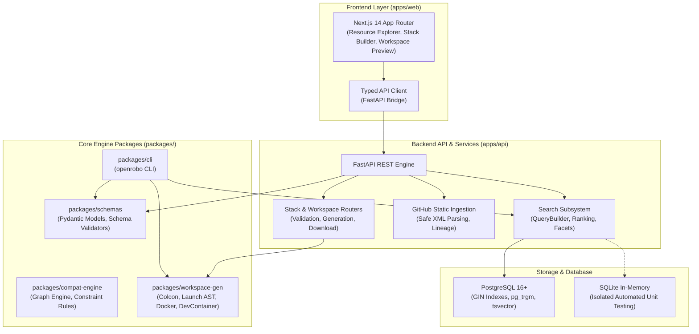

<div align="center">

# OpenRobo

**Open-source robotics platform for discovering components, reasoning about compatibility, building robot stacks, and generating reproducible developer environments.**

[](https://github.com/Tanishk756/OpenRobo/actions/workflows/ci.yml)
[](https://opensource.org/licenses/Apache-2.0)
[](https://www.python.org/)
[](https://www.typescriptlang.org/)
[](https://fastapi.tiangolo.com/)
[](https://nextjs.org/)
[](https://docs.ros.org/)
[](#architecture)

</div>

---

## What is OpenRobo?

Robotics software engineering is fragmented across hundreds of isolated repositories, disparate ROS packages, custom sensor drivers, and fragile dependency chains. Integrating a robot stack—from LiDAR SLAM and arm kinematics to hardware interfaces and simulation—often requires hours of manual dependency debugging.

**OpenRobo** provides a standardized, vendor-neutral software registry, intelligent compatibility engine, stack builder, and automated workspace synthesis platform for modern robotics:
- **Discover Components**: Search thousands of ROS 2 packages, hardware drivers, simulation models, and algorithms with weighted full-text and fuzzy typo-tolerant indexing.
- **Understand Compatibility**: Graph-based constraint validation mapping cross-package compatibility across ROS distributions, CPU architectures, and OS kernels.
- **Build Robot Stacks**: Compose modular robotics architectures with interactive dependency checking and one-click conflict resolution (`/stack-builder`).
- **Generate Workspaces**: Synthesize deterministic, reproducible Colcon workspaces, REP-149 bringup meta-packages, AST-validated launch scripts, multi-stage Dockerfiles, Dev Containers, and lockfiles (`openrobo.lock.json`).

---

## Implemented Features (Available Now)

- [x] **Canonical Robotics Schemas**: JSON Schema (Draft 2020-12) standards for resource manifests (`resource.schema.json`), compatibility graphs (`graph.schema.json`), and robot stacks (`stack.schema.json`).
- [x] **Knowledge Graph & Compatibility Intelligence**: Deterministic reasoning layer evaluating ROS 2 distributions (Humble, Jazzy, Iron, Rolling), OS, CPU architecture (x86_64, aarch64), SemVer constraints, required hardware/capabilities, cycle detection, and conflict propagation with sub-50ms matrix performance.
- [x] **Zero-Extra-Infrastructure Search Engine**: PostgreSQL-backed weighted full-text search (`tsvector`, GIN indexes) with `pg_trgm` fuzzy similarity matching and multi-taxonomy faceting.
- [x] **Interactive Robotics Stack Builder**: Visual 3-panel stack composition studio (`/stack-builder`) with real-time constraint evaluation, starter templates, dependency auto-resolution proposals, and manifest import/export.
- [x] **Deterministic Workspace & Deployment Generator (Milestone 5)**: Synthesizes fully functional ROS 2 colcon workspaces, launch pipelines, parameter configurations, multi-stage Dockerfiles, Docker Compose definitions, VS Code Dev Containers, setup scripts, and byte-reproducible ZIP bundles.
- [x] **Verified Hardware & Framework Adapters**: Explicit synthesis adapters for Nav2 navigation pipelines, SLAM Toolbox 2D mapping, ros2_control controller managers, and Gazebo simulation bridges.
- [x] **Reproducible Lockfiles & Provenance**: Generates cryptographic lockfiles (`openrobo.lock.json`) capturing component digests, repository URLs, build types, and upstream licenses.
- [x] **Static Robotics Repository Ingestion**: Safe, non-executing static analysis of GitHub repositories extracting ROS `package.xml` manifests, dependencies, maintainers, and licenses with full provenance tracking.
- [x] **Unified CLI**: Typer/Rich command-line suite for schema validation, static GitHub ingestion, ranked registry search, and workspace preview/generation/archive (`openrobo workspace`).
- [x] **Cross-Platform Compatibility**: Full first-class support for Linux, macOS, and Windows development workflows.

---

## Architecture

OpenRobo is structured as a zero-extra-infrastructure monorepo managed with **pnpm** and **Python virtual environments**:



---

## Quickstart

### 1. Prerequisites

- Python 3.10+
- Node.js 18+ and pnpm 8+
- PostgreSQL 14+ (or SQLite in-memory for testing)

### 2. Installation

```bash
# Clone the repository
git clone https://github.com/Tanishk756/OpenRobo.git
cd OpenRobo

# Install Node dependencies
pnpm install

# Install Python packages in development editable mode
pip install -e packages/schemas
pip install -e packages/compat-engine
pip install -e packages/workspace-gen
pip install -e packages/cli
pip install -e apps/api
```

### 3. CLI Workspace Generation

```bash
# Preview a synthesized ROS 2 workspace from a stack manifest
openrobo workspace preview samples/mobile_robot_nav.stack.json

# Generate colcon workspace files and container definitions to a folder
openrobo workspace generate samples/mobile_robot_nav.stack.json --output ./my_robot_ws

# Export a deterministic ZIP archive bundle
openrobo workspace archive samples/mobile_robot_nav.stack.json --output ./my_robot_ws.zip
```

### 4. Running the Web Platform & API Locally

```bash
# Start FastAPI backend (Port 8000)
pnpm run api:dev

# Start Next.js frontend (Port 3000)
pnpm run web:dev
```

Open [http://localhost:3000/stack-builder](http://localhost:3000/stack-builder) to visually compose robotics stacks and generate deployments.

---

## Testing & Quality Assurance

Run the comprehensive monorepo verification check:

```bash
pnpm run check
```

This executes:
1. `python -m ruff check .` (Python linting)
2. `python scripts/validate_schemas.py` (Canonical JSON schema validation)
3. `python -m pytest` (Full Python test suite across API, Compat Engine, Workspace Gen, CLI)
4. `pnpm --filter openrobo-web lint` (Next.js ESLint)
5. `pnpm --filter openrobo-web test` (Vitest unit tests)
6. `pnpm --filter openrobo-web build` (Next.js production bundle compilation)

---

## License

Licensed under the **Apache License, Version 2.0**. See [LICENSE](LICENSE) for details.