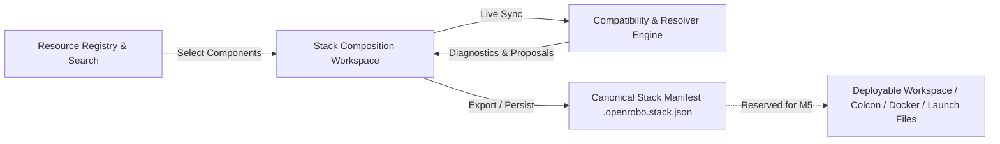

# Milestone 4 ? Interactive Robotics Stack Builder

## 1. Executive Summary & Product Objective
Milestone 4 transforms OpenRobo into an interactive, end-to-end robotics engineering stack assembly and validation platform. A robotics engineer can assemble a full software and hardware component stack (from hardware drivers and middleware up to localization, navigation, perception, and simulation) with continuous real-time compatibility validation, dependency resolution proposals, and canonical manifest import/export.

---

## 2. Architecture & Design

### 2.1 Canonical Stack Schema (`schemas/stack.schema.json`)
The canonical schema is extended with:
- Optional top-level fields: `description`, `created_at`, `updated_at`, `metadata`.
- Target platform fields: `ros_distribution` (alongside `ros_version`), `os`, `arch`.
- Component fields: `resource_id`, `version`, `category`, `optional`, `notes`.
- Preserves strict Draft 2020-12 compliance.

### 2.2 Database Persistence Layer (`apps/api/models/stack.py`)
- `StackModel` table `stacks`:
  - `id` (VARCHAR primary key)
  - `name` (VARCHAR indexed)
  - `version` (VARCHAR)
  - `description` (TEXT optional)
  - `robot_domain` (VARCHAR)
  - `robot_type` (VARCHAR)
  - `target_os` (VARCHAR)
  - `target_arch` (VARCHAR)
  - `target_ros_distro` (VARCHAR)
  - `components_json` (JSON list of component items)
  - `metadata_json` (JSON dictionary)
  - `created_at`, `updated_at` (TIMESTAMPTZ)
- Alembic migration `0005_stack_persistence.py`.

### 2.3 Dependency & Version Resolver (`packages/compat-engine/openrobo_compat/resolver.py`)
- Inspects `DEPENDS_ON`, `REQUIRES`, `PROVIDES`, and `INCOMPATIBLE_WITH` relationships across selected components.
- Analyzes missing mandatory vs. optional dependencies.
- Proposes minimal resolution actions (`ADD_COMPONENT`, `UPGRADE_VERSION`, `DOWNGRADE_VERSION`, `REMOVE_CONFLICTING`) with clear rationales.
- Detects transitive cycles and version range unsatisfiability.

### 2.4 REST API Specification (`apps/api/routers/stacks.py`)
| Method | Endpoint | Description |
|---|---|---|
| `POST` | `/api/v1/stacks` | Create new stack |
| `GET` | `/api/v1/stacks` | List saved stacks with filtering |
| `GET` | `/api/v1/stacks/{id}` | Get stack details |
| `PATCH` | `/api/v1/stacks/{id}` | Update stack |
| `DELETE` | `/api/v1/stacks/{id}` | Delete stack |
| `POST` | `/api/v1/stacks/{id}/validate` | Live compatibility validation |
| `POST` | `/api/v1/stacks/{id}/resolve` | Dependency resolution proposal |
| `GET` | `/api/v1/stacks/{id}/manifest` | Export canonical `.openrobo.stack.json` |
| `POST` | `/api/v1/stacks/import` | Safe untrusted manifest import & validation |
| `GET` | `/api/v1/stacks/templates` | Predefined robotics starter templates |

### 2.5 Frontend Interactive Stack Builder (`apps/web/app/stack-builder/`)
- **Top Bar**: Stack name, description, target environment dropdowns (ROS Distro, OS, Arch), Save/Draft status, Import/Export buttons, Templates picker.
- **Left Panel (Library)**: Integrated search with domain/capability filters, quick-add buttons.
- **Center Panel (Composition)**: Categorized pipeline cards (Sensors, Middleware, Perception, Localization, SLAM, Navigation, Control, Simulation), version dropdowns, remove actions, missing dependency indicators.
- **Right Panel (Inspector)**:
  - **Health Summary**: Categorical stats (compatible/conditional/incompatible/unknown count, missing dependencies, cycles).
  - **Diagnostics Log**: Rule-by-rule evaluations, dependency paths, remediation advice.
  - **Auto-Resolve Button**: Opens resolution proposal modal with diff view and 1-click apply.
  - **Graph View Tab**: Lightweight visualization of component relationships.
  - **Manifest View Tab**: Live JSON preview with copy/export.

---

## 3. Scope Boundary (M4 vs. M5)
- **Milestone 4 (Current)**:
  - Stack design, composition, persistence, editing.
  - Live compatibility validation and diagnostic reporting.
  - Dependency and version conflict resolution.
  - Canonical manifest import/export (`.openrobo.stack.json`).
  - Starter templates.
- **Milestone 5 (Next)**:
  - Full deployable colcon workspace generation.
  - ROS 2 launch file synthesis.
  - Docker / Devcontainer generation.
  - rosdep automation scripts.
  - URDF/Xacro and simulation asset scaffolding.

---

## 4. Testing & Verification Plan
- **Backend Tests**:
  - `packages/compat-engine/tests/test_resolver.py` (dependency tree resolution, cycle prevention, version intersection).
  - `apps/api/tests/test_stacks_api.py` (CRUD, live validation, resolution proposals, import/export, templates).
- **Frontend Tests**:
  - `apps/web/tests/unit/stack_builder.test.tsx` (rendering, component addition/removal, environment selector, resolution modal).
- **Performance**:
  - Stack validation benchmark target: `< 100 ms` for typical 10-50 component stacks.
- **Full Verification**:
  - `pnpm run check` (Ruff, Schemas, Pytest, ESLint, Vitest, Next.js build).
  - GitHub Actions CI green verification.
