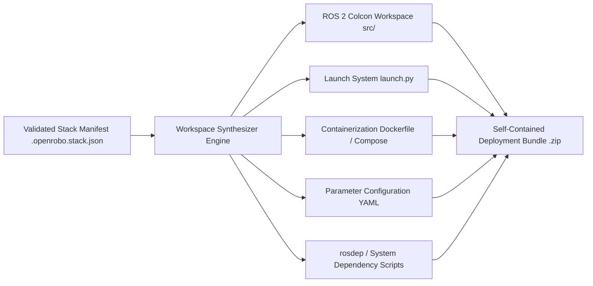

# Milestone 5 ? Workspace & Deployment Generation (Implementation Plan)

## 1. Executive Summary & Objective
Milestone 5 builds on the validated robotics stack models established in Milestone 4 by providing automated synthesis of complete, deployable robotics development and runtime environments. Given a validated OpenRobo stack manifest (`.openrobo.stack.json`), OpenRobo will generate complete colcon workspaces, launch files, Docker environments, parameter configurations, and deployment bundles.

---

## 2. Architectural Scope & Components

### 2.1 Workspace Generator Engine (`packages/workspace-gen`)
- **Package Manifest Synthesis**: Generates `package.xml` and `CMakeLists.txt` for top-level meta-packages and bringup nodes.
- **Dependency Provisioner**: Generates `rosdep` installation scripts, apt/pip requirement files, and third-party repository clone scripts for source builds.
- **Target Platform Adaptations**: Customizes builds for ROS 2 Jazzy, Humble, Iron, or Rolling on Ubuntu 24.04, 22.04, Debian 12, or containerized Linux on Windows/macOS.

### 2.2 Launch & Runtime Orchestration
- **ROS 2 Launch Synthesis**: Auto-generates modular Python launch files (`launch/robot_bringup.launch.py`) with lifecycle manager hooks for Nav2, SLAM Toolbox, sensor drivers, and controller managers.
- **Parameter Synthesis**: Synthesizes standard parameter YAML files (e.g. `nav2_params.yaml`, `slam_toolbox_params.yaml`, `ros2_control_params.yaml`).

### 2.3 Container & Cloud Deployment
- **Multi-Stage Dockerfiles**: Generates optimized base and runtime container images with ROS 2, DDS middleware configuration (CycloneDDS / FastDDS), and pre-installed system dependencies.
- **Docker Compose**: Prepares multi-service deployment definitions (e.g., simulation container, hardware driver daemon, telemetry logging).
- **VS Code Dev Containers**: Generates `.devcontainer/devcontainer.json` for 1-click developer onboarding.

### 2.4 Simulation & Asset Scaffolding
- **Gazebo Simulator Bridges**: Generates simulation world launch files and `ros_gz_bridge` topics mapping sensor and actuator channels.
- **URDF / Xacro Scaffolding**: Provides base robot description templates and link hierarchies for selected platforms.

### 2.5 REST API & Export Formats
- `POST /api/v1/workspace/generate`: Synthesizes workspace files in-memory from a stack manifest.
- `GET /api/v1/stacks/{id}/workspace/download`: Streams a `.zip` or `.tar.gz` deployment archive.
- `GET /api/v1/workspace/preview`: Returns file tree structure and file contents for browser preview.

---

## 3. Scope Boundary
- Milestone 4 handles stack composition, compatibility evaluation, and dependency resolution.
- Milestone 5 takes a validated stack manifest and generates physical workspace files.
- Milestone 6 will introduce deep simulation adapters (Gazebo, Webots, MuJoCo live execution).

---

## 4. Testing & Verification Strategy
- **Unit Tests**: Template rendering correctness, YAML validity, `package.xml` compliance with ROS 2 REP-149.
- **Integration Tests**: Dockerfile build test with colcon workspace build validation.
- **API Tests**: Workspace generation endpoint responses and archive integrity.
- **CLI Commands**: `openrobo workspace generate <stack.json> --output ./my_robot_ws`.
