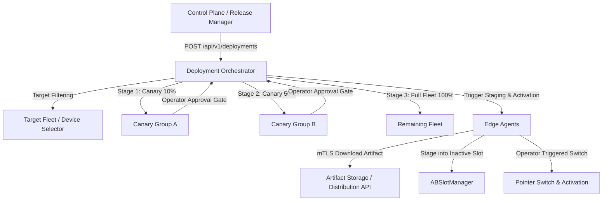

# Milestone 7.2.2 — Authenticated Remote Deployment Orchestration & Canary Rollout Plan

## 1. Objective

Build on the Milestone 7.2.1 / 7.2.1.1 cryptographic release artifact and local A/B slot foundation to introduce:
1. Authenticated remote deployment requests over mTLS / control-plane channels.
2. Controlled artifact distribution and download verification.
3. Fleet-wide targeting, deployment rollout state machine, and progressive canary rollouts.

> [!IMPORTANT]
> Milestone 7.2.2 focuses purely on orchestration, scheduling, and canary stages with explicit operator approval gates. Automatic runtime health gates and automatic metric rollback triggers belong to Milestone 7.2.3.

---

## 2. Architectural Components



### 2.1 Backend / API Orchestration (`apps/api/`)
- **Deployment Models** (`apps/api/models/deployment.py`):
  - `Deployment`: Root deployment record tracking `release_id`, `target_filter`, `rollout_strategy`, `status`, `created_at`, `updated_at`.
  - `DeviceDeployment`: Per-device state machine tracking device state (`PENDING`, `STAGING`, `STAGED`, `AWAITING_APPROVAL`, `ACTIVATING`, `ACTIVE`, `FAILED`, `CANCELLED`).
  - `RolloutStrategy`: Configuration model for canary stages (percentages, device batch sizes, manual approval requirements).
- **Deployment Service** (`apps/api/services/deployment_service.py`):
  - Resolves target device cohorts deterministically (hash-based or explicit device lists).
  - Emits deployment envelopes containing `release_id`, `manifest_digest`, `artifact_digest`, `artifact_source_id`.
  - Enforces operator approval gates between canary stages.
- **REST Endpoints** (`apps/api/routers/deployments.py`):
  - `POST /api/v1/deployments`: Create deployment with target filters and rollout strategy.
  - `GET /api/v1/deployments`: List deployments with status summaries.
  - `GET /api/v1/deployments/{id}`: Detailed deployment status including per-device progress.
  - `POST /api/v1/deployments/{id}/approve`: Operator approval to advance canary to next stage.
  - `POST /api/v1/deployments/{id}/cancel`: Cancel active rollout.

### 2.2 Controlled Artifact Distribution & Ingestion
- **Trusted Source Resolution**: Agents never accept arbitrary client-supplied artifact URLs. Agents resolve downloads via pre-configured trusted endpoints using `artifact_source_id` and `release_id`.
- **Streaming Verification**: Edge agent streams artifact downloads directly to quarantine directories while verifying content lengths, transfer size limits, and SHA-256 digests.

### 2.3 Agent Remote Orchestration Handler (`packages/agent-core/`)
- **Remote Instructions**: Agent receives deployment jobs via mTLS polling or secure WebSocket.
- **Execution Flow**:
  1. `RESOLVE_TRUST`: Verify `release_key_id` against local `TrustedReleaseKeyStore`.
  2. `FETCH_ARTIFACT`: Download artifact from trusted distribution source.
  3. `STAGE_SLOT`: Unpack into quarantine, verify hashes, move to inactive slot, mark `VERIFIED`.
  4. `AWAIT_ACTIVATION`: Await operator activation signal.
  5. `ACTIVATE_SLOT`: Fresh safety policy check, write journal, atomic pointer flip.
  6. `REPORT_STATUS`: Transmit execution telemetry and slot state to control plane.

---

## 3. Canary Rollout State Machine (Operator-Gated)

```
[CREATE]
   │
   ▼
[TARGETS_RESOLVED]
   │
   ▼
[STAGE_CANARY_COHORT] ──► [CANARY_STAGED] ──► [AWAITING_OPERATOR_APPROVAL]
                                                        │ (Operator Approves)
                                                        ▼
[ACTIVATE_CANARY] ◄─────────────────────────────────────┘
   │
   ▼
[CANARY_ACTIVE] ──► [AWAITING_OPERATOR_APPROVAL]
                              │ (Operator Approves Next Stage)
                              ▼
                   [STAGE_NEXT_COHORT] ──► ... ──► [COMPLETED]
```

---

## 4. Verification Plan

1. **Target Filter & Cohort Selection Unit Tests**:
   - Deterministic device assignment to canary cohorts.
   - Target filtering by tags, architecture, and ROS distribution.
2. **Deployment State Machine Unit Tests**:
   - State transition validation (`PENDING` -> `STAGING` -> `STAGED` -> `AWAITING_APPROVAL` -> `ACTIVE`).
   - Operator approval gating and cancellation handling.
3. **End-to-End Multi-Agent Remote OTA Simulation**:
   - Multi-device rollout with canary stage progression, operator approvals, and slot verification.
