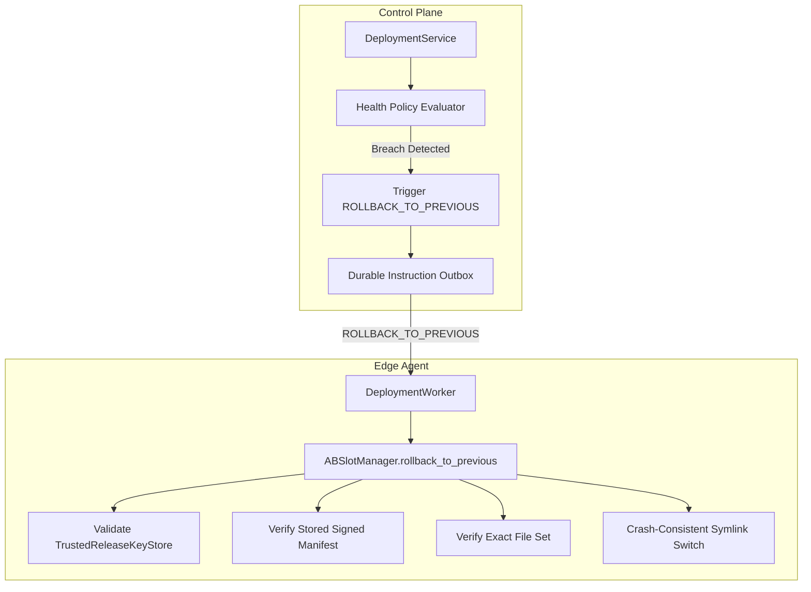

# Milestone 7.2.3 Implementation Plan (PLAN ONLY — DO NOT IMPLEMENT)

> [!NOTE]
> This document is a planning specification for Milestone 7.2.3. Implementation will begin only in the designated subsequent milestone pass after M7.2.2.1 is merged.

---

## 1. Goal Description

Milestone 7.2.3 builds upon M7.2.2.1's operator-gated canary deployment engine by adding:
1. **Runtime Telemetry Health Gates**: Automated policy evaluation over ROS topic frequency, hardware error rates, and connection health during canary dwell time.
2. **Autonomous Rollback Engine (`ROLLBACK_TO_PREVIOUS`)**:
   - Automated rollback must NOT be implemented as `ACTIVATE_RELEASE(previous_slot)` (which bypasses rollback verification).
   - Future rollback must use a typed operation `ROLLBACK_TO_PREVIOUS` which invokes the verified `rollback_to_previous()` path in `ABSlotManager`, including:
     - Trusted signing key validation (`TrustedReleaseKeyStore`)
     - Stored signed manifest verification (`ReleaseManifest`)
     - Exact file-set verification against the signed manifest
     - Fresh safety policy evaluation
     - Crash-consistent pointer transition
   - Universal `<500 ms` rollback requirement removed; rollback duration is governed by hardware storage sync semantics and platform-specific requirements.
3. **Fleet Studio Rollout UI**: Real-time deployment dashboard in `apps/web` with live stage progress bar, canary health metrics, and interactive operator approval buttons.

---

## 2. Architecture & Design Principles

---

## 3. Implementation Phases (Planned)

### Phase 1: Health Policy Engine & Metric Aggregation
- Define declarative `HealthPolicyConfig` (e.g. max error rate, min topic frequency, heartbeat latency).
- Implement background health evaluator during canary bake windows.

### Phase 2: Typed `ROLLBACK_TO_PREVIOUS` & Crash-Consistent Reversion
- Add `InstructionType.ROLLBACK_TO_PREVIOUS`.
- Wire `DeploymentWorker._handle_rollback_to_previous` to invoke `ABSlotManager.rollback_to_previous()`.
- Emit truthful `ROLLING_BACK` and `ROLLED_BACK` status reports.

### Phase 3: Fleet Studio Real-Time Rollout UI
- Create `/deployments` and `/deployments/[id]` pages in `apps/web`.
- Live SSE / WebSocket updates of device states across canary stages.
- Interactive operator approval buttons for stage promotion and activation.
